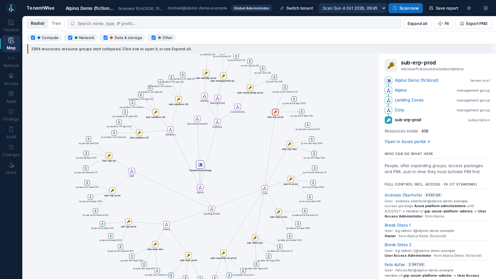
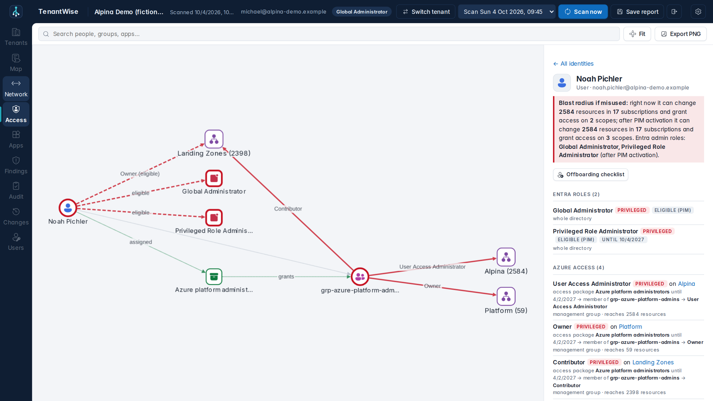
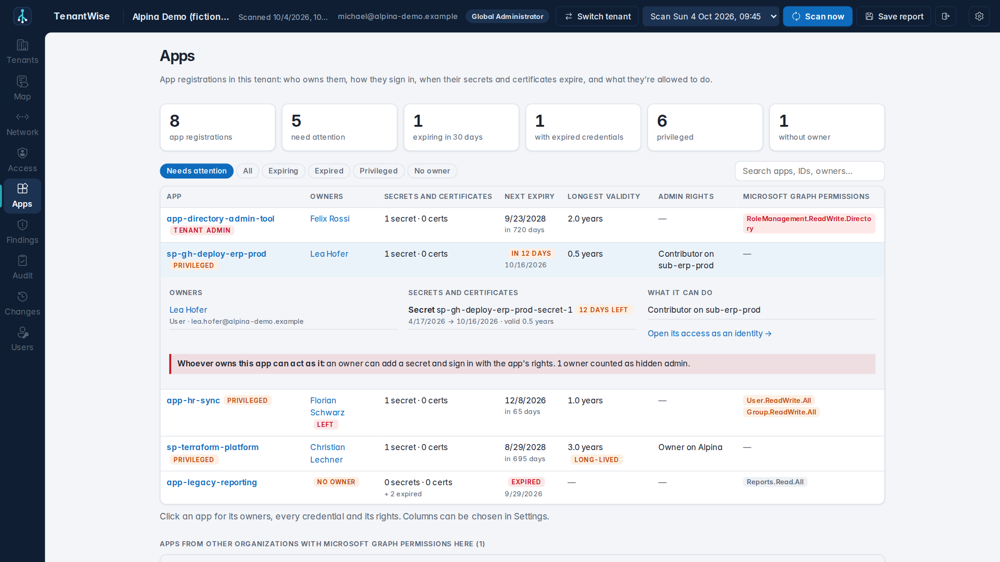
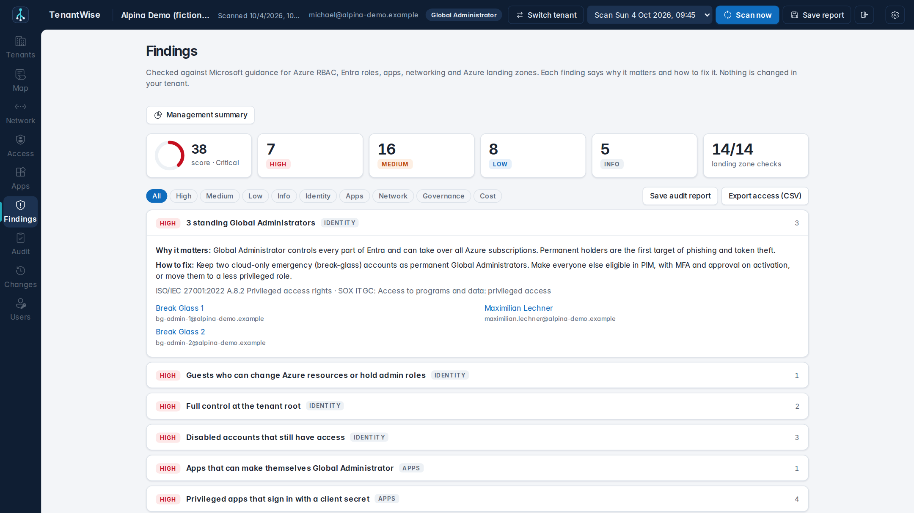
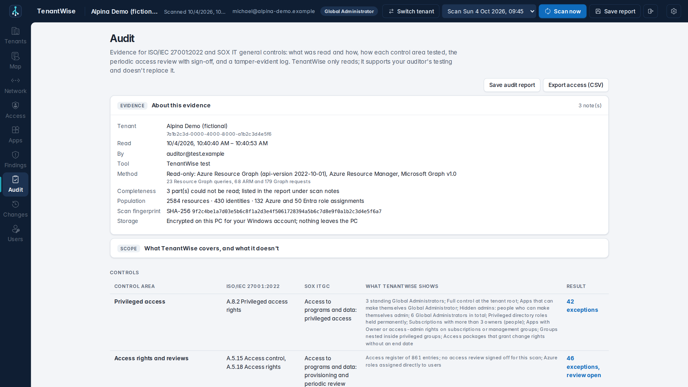
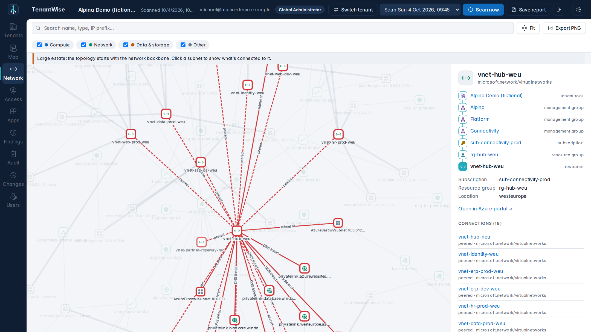
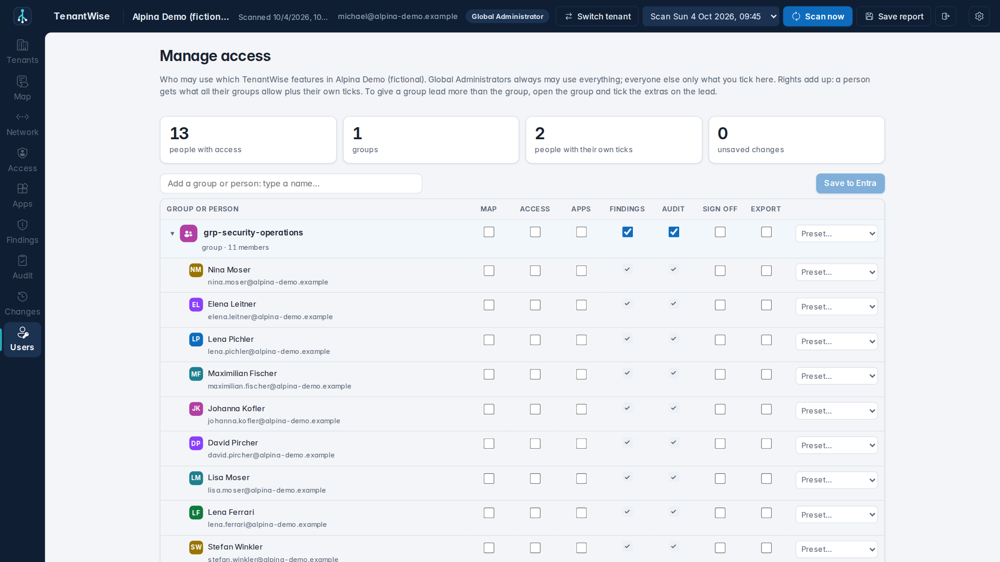
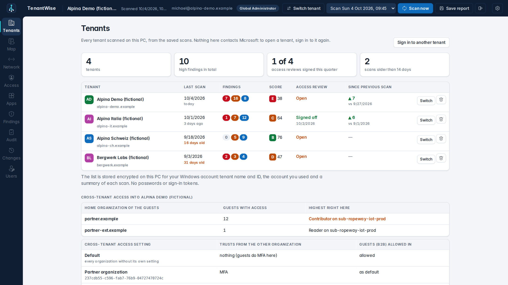
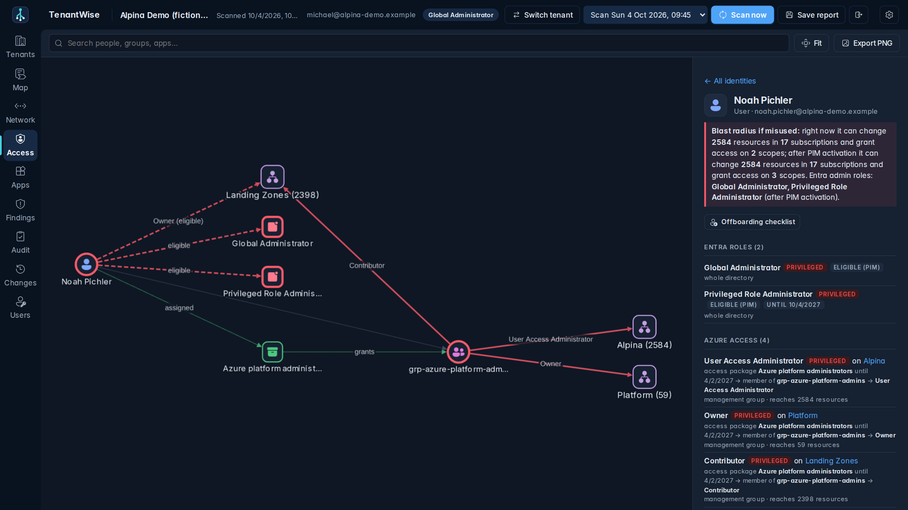
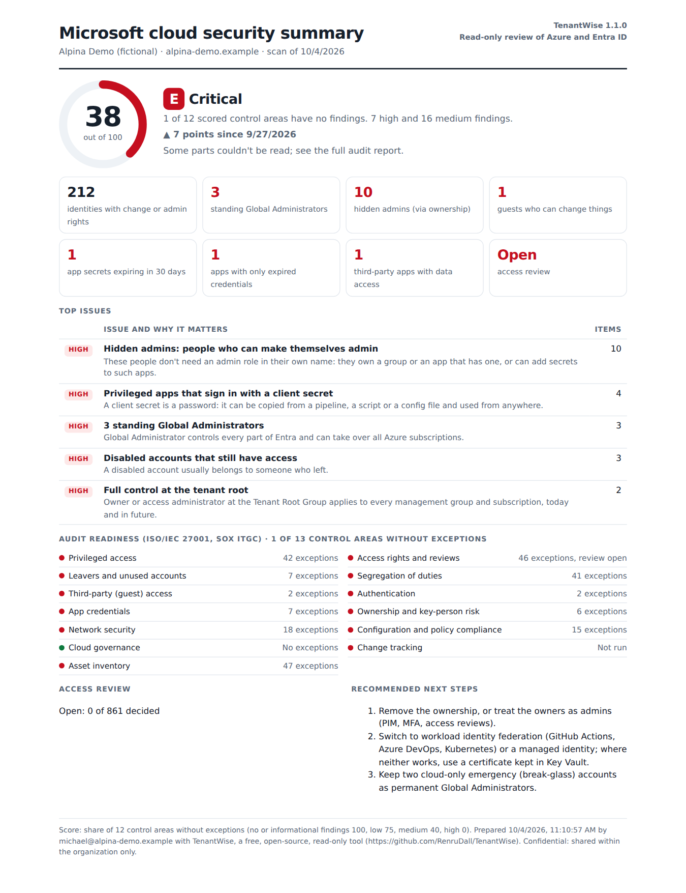

# TenantWise — for Azure

See your whole Microsoft cloud from the tenant root down: who can do what, where, and why.
Two read-only tools:

- **TenantWise** — a Windows app that maps the whole Entra → Azure landscape: identities and their roles,
  management groups and landing zones, policies, resources and how they connect. [Jump to TenantWise](#tenantwise--desktop-app-for-the-whole-entra--azure-landscape)
- **TenantWise Inventory workbook** — an Azure Monitor workbook that inventories resources with Azure Resource Graph,
  right in the portal. Every grid can be filtered and exported to Excel.

> **Free and open source.** No paid editions, no account, no telemetry: TenantWise runs on your PC and talks only to Microsoft.
> See [SECURITY.md](SECURITY.md) for the security model and how to report a vulnerability.
>
> Independent open-source project. Not affiliated with or endorsed by Microsoft.



| | |
| --- | --- |
|  **Access:** everything a person can reach, through which group, access package and PIM, and the blast radius |  **Apps:** owners, secrets and certificates with expiry, admin rights and Microsoft Graph permissions |
|  **Findings:** checked against Microsoft guidance, with a score and a one-page management summary |  **Audit:** ISO/IEC 27001 and SOX evidence, access reviews with sign-off, tamper-evident log |
|  **Network:** VNets, peerings, subnets, firewalls, private endpoints and DNS links |  **Manage access:** Global Administrators tick features per group or person |
|  **Tenants:** every tenant scanned on this PC, with score, trend and cross-tenant access |  **Dark mode**, presentation mode and settings for views, columns and thresholds |

<details><summary>Management summary (one page for leadership)</summary>


</details>

*Screenshots show a fictional tenant built for testing.*
> "Azure" is a trademark of Microsoft Corporation.

## Workbook tabs

| Tab | What you get |
| --- | --- |
| Overview | Totals, top resource types, resources by location and subscription |
| All resources | Full inventory with resource-type filter |
| Compute | VMs (size, OS, power state, disks, zones), scale sets, managed disks (incl. unattached), AKS, App Service plans and apps |
| Networking | VNets, subnets (NSG, route table, NAT, delegation), public IPs (incl. unassociated), NSGs, private endpoints, gateways/firewalls/load balancers |
| Storage & data | Storage accounts (TLS, public access, HNS), key vaults, SQL servers/databases, other data and messaging services |
| Tags | Coverage per tag key, tag values, untagged resources |
| Subscriptions & RGs | Subscriptions with parent management group, resource groups with resource counts |

Scope filters apply to every tab: **subscriptions, resource groups, locations, tag name / value**.

## Workbook requirements

- **Reader** on the subscriptions (or management group) you want to see — nothing more.
- The workbook only reads Azure Resource Graph; it makes no changes.

## Install the workbook

**Option A — paste (fastest)**
1. Azure portal → *Monitor* → *Workbooks* → *New*.
2. Open the *Advanced editor* (`</>`), choose *Gallery Template*.
3. Replace the content with `tenantwise-inventory.workbook.json` → *Apply* → *Save*.

**Option B — Bicep**
```bash
az deployment group create -g <resource-group> -f main.bicep
```
`main.bicep` loads the JSON file directly, so the two never drift apart.

## TenantWise — desktop app for the whole Entra → Azure landscape

TenantWise is a Windows app that shows your tenant as one picture:
**who has which rights, where subscriptions land, which policies apply, and what's deployed and connected.**
Install it, sign in with your work account (MFA as usual), click **Scan now**. It only reads, and everything stays on your PC.

### Views
- **Tenants** — every tenant you've scanned on this PC in one table: last scan, findings, score, access review status and
  the trend since the previous scan, plus **cross-tenant access** (guests from other organizations with rights here, and
  which partners' MFA and devices you trust). **Switch tenant** signs you out and opens Microsoft sign-in for the chosen
  tenant with the account filled in: every tenant gets a fresh sign-in with MFA, and no sign-in is kept between tenants.
- **Mind map** — tenant root → management groups (including empty landing zones) → subscriptions → resource groups → resources.
  Click any scope to see its **landing-zone path**, **who has access there** (assigned or inherited) and **which policies apply**
  (inherited, enforcement mode, non-compliant count).
- **Topology** — how resources connect: NIC ↔ VM, subnets, VNet peerings, NSGs, route tables (and the firewall they route to),
  NAT gateways, public IPs, private endpoints, load balancers, application gateways, VPN/ExpressRoute connections,
  private DNS links, AKS, App Service, disks. Large estates start with the network backbone; click a subnet to open it.
- **Access** — Entra identities → groups → Entra directory roles and Azure RBAC roles → the management groups,
  subscriptions, resource groups and resources they reach, as a privilege map.
  **Who can do this, and why:** click any scope to see the *people* who can change it, with the full chain —
  access package → group → PIM for Groups → role (active or PIM-eligible, with end dates) → scope.
  Pick any user, group or app for everything it can do and its **blast radius** (how many resources and subscriptions
  it could change right now, and after PIM activation). Also access packages, pending requests, guests and Conditional Access.
  **Hidden admins:** people who hold no admin role themselves but own a group or an app that has one (an owner can add
  themselves, or a secret, and act with its rights), Application Administrators who can take over privileged apps, and
  everyone who can activate admin roles through PIM.
  **Offboarding checklist** for any person: what to hand over first (subscriptions, apps and groups only they manage),
  then every role, group, access package and ownership to remove. Saved as a file to tick off.
- **Apps** — every app registration: owners (and whether they've left), each secret and certificate with its expiry and
  lifetime, admin rights in Azure and Entra, and Microsoft Graph application permissions, flagging the ones that let an
  app make itself Global Administrator. Also apps from other organizations with permissions in your tenant.
- **Findings** — checks against Microsoft guidance, each with *why it matters* and *how to fix*: standing Global
  Administrators, permanent privileged roles, guests with change rights, direct user assignments, deleted identities,
  owners per subscription, root-level access, pipeline apps with Owner, subnets without NSG, VMs with public IPs,
  spokes not routed through the hub firewall, subscriptions outside landing zones or without policy, non-compliance,
  expiring access, disabled accounts that still have access, privileged accounts unused for 90 days, people who can change
  both production and non-production, unattached disks and unused IPs, hidden admins, groups nested in privileged groups,
  apps that can make themselves Global Administrator, privileged apps with client secrets, expiring and long-lived secrets,
  apps without owners or whose owners left, third-party apps with write access, subscriptions only one person can manage,
  a single Global Administrator — plus a landing zone structure check (CAF reference).
  **Management summary** saves one printable page for leadership: a score out of 100, the top issues in plain language,
  the trend since the previous scan, audit readiness and the access review status.
  Each finding names the ISO/IEC 27001:2022 Annex A control and the SOX IT general control area it belongs to.
- **Audit** — evidence for ISO 27001 and SOX audits: how the data was produced, a control summary, the audit scope,
  the **periodic access review** with sign-off, and the tamper-evident activity log ([details](#iso-27001-and-sox)).
- **Changes** — compares any two scans: who gained or lost access (roles, group membership, access packages),
  moved subscriptions, new or removed resources and connections, policy and enforcement changes.

### Install
1. Download **`TenantWise-Setup-<version>.exe`** from the latest release.
2. Run it. It installs for your user only (no admin rights) and adds **TenantWise** to the Start menu.
3. Open TenantWise, enter your work email and the app (client) ID of TenantWise's registration in your tenant
   ([set up once per tenant](#set-up-the-app-registration-once-per-tenant)), and click **Sign in with Microsoft**.
   Microsoft's own sign-in appears — password or passwordless, **MFA**, Conditional Access, or simply the account
   you're already signed in with on Windows. TenantWise never sees your password.
4. Click **Scan now**.

Needs Windows 10 or 11 (x64). Everything it needs is already part of Windows (.NET Framework 4.8 and the Edge
WebView2 runtime; the installer points you to WebView2 in the rare case it's missing).
A portable zip is also attached to each release. Releases are code-signed through SignPath Foundation
([code signing policy](CODE_SIGNING.md)); `SHA256SUMS.txt` lists the hashes (`Get-FileHash <file>`).
Older unsigned builds (1.1.0 and earlier) are blocked by Windows Smart App Control and may trigger SmartScreen.

### ISO 27001 and SOX
TenantWise produces evidence auditors can rely on. It is not certified and doesn't replace the auditor's own testing,
but it covers what they ask for in access and cloud-governance controls:

| Control area | ISO/IEC 27001:2022 Annex A | SOX IT general controls | Evidence in TenantWise |
| --- | --- | --- | --- |
| Access rights and reviews | A.5.15, A.5.18 | Access to programs and data: provisioning, periodic review | Access register; access review with keep / remove / ask decisions, reviewer statement and sign-off |
| Privileged access | A.8.2 | Privileged access | Standing admins, root access, owners per subscription, PIM, privileged access register |
| Leavers and unused accounts | A.5.16, A.5.18 | Terminated users | Disabled accounts that still have access, deleted identities, privileged accounts unused for 90 days |
| Segregation of duties | A.5.3 | Segregation of duties | People with standing change rights in production and non-production |
| Third-party access | A.5.19, A.5.20 | Third parties | Guests and what they can change |
| Authentication | A.8.5 | Authentication | Conditional Access policies and report-only gaps |
| Change tracking | A.8.32 | Program changes | Changes between scans: access, structure, policies, resources |
| Configuration and policy compliance | A.8.9, A.5.36 | Configuration baseline | Azure Policy assignments, enforcement and non-compliance |
| Network security | A.8.20, A.8.22 | Supporting control | NSGs, public IPs on VMs, spokes not routed through the firewall |
| App credentials | A.5.17, A.8.24 | Authentication | Secrets and certificates: privileged apps on secrets, expiring, long-lived, expired |
| Ownership and key-person risk | A.5.2, A.5.9 | Administration | Apps without owners or whose owners left, scopes only one person can manage, single Global Administrator |
| Cloud governance, asset inventory | A.5.23, A.5.9 | Scoping | Landing zone structure, complete resource inventory |

**How it keeps evidence reliable**
- **Read-only.** TenantWise only reads, with the signed-in person's own rights. The one exception: Global Administrators can save who may use TenantWise.
- **Provenance.** Every scan records who ran it, when, with which version, which APIs it used, how many requests it
  made and what it could not read (completeness). The audit report starts with this.
- **Fingerprints.** Each scan and each exported file (audit report, access CSV, signed access review) gets a SHA-256 hash.
- **Tamper-evident activity log.** Sign-ins, scans, comparisons, exports and review sign-offs are written to
  `%LOCALAPPDATA%\TenantWise\activity.log`, each entry chained to the previous one by SHA-256. The *Audit* view verifies
  the chain; any edited, removed or reordered entry is reported. Auditors check an exported file with `Get-FileHash`
  against the log entry.
- **Encrypted at rest.** Scans, audit scope and reviews are encrypted with Windows DPAPI for the signed-in Windows user;
  nothing is sent anywhere. Scans with a signed-off access review are never removed automatically.

**Running an access review (SOX quarterly user access review, ISO A.5.18)**
1. *Audit → Audit scope:* tick the subscriptions in scope (for SOX: those running financially relevant systems) and
   confirm which are production.
2. *Audit → Access review:* decide each access (*Keep*, *Remove* with reason or ticket, *Ask* the owner). Decisions save
   as you go.
3. Sign off: enter the reviewer, confirm the statement, *Sign off and save evidence*. TenantWise saves the signed review
   (HTML) and its population (CSV), both hashed and logged.
4. *Save audit report* for the full evidence pack: provenance, control summary, review status, findings, privileged
   access register, policies, changes since the compared scan, scan notes.

**Settings** (gear, top right) choose what TenantWise shows: light or dark, which views appear, which columns the Apps
and Tenants tables and the CSV export include (columns auditors need are always kept, recommended ones are marked), the
thresholds for findings (secret expiry, secret lifetime, unused admins, owners per subscription, out-of-date scans), and
**presentation mode**, which replaces people's names and emails with placeholders on screen and in exports, for demos
and slides.

### Who can use what
**Only Global Administrators can use TenantWise until they give others access.** They do it in TenantWise itself, under
**Users**: search for any group or person in the directory and tick the features they may use.

| Feature | Allows |
| --- | --- |
| Map | The map and network views |
| Access | Who can do what, hidden admins, offboarding checklists |
| Apps | App registrations, secrets, certificates, permissions |
| Findings | Findings and the management summary |
| Audit | The Audit view (evidence, scope, access review decisions, activity log) and Changes |
| Sign off | Signing off access reviews (keep it with the reviewer, not the auditor: segregation of duties) |
| Export | Saving reports, CSV exports, the audit report, offboarding checklists and the management summary |

- **Groups and people.** Tick features for a group, open it to see its members, and tick extras for single members, for
  example a group lead. Rights add up: a person gets what all their groups allow plus their own ticks.
- **Presets** fill a row in one click: Reader (all views), Auditor (Findings, Audit, Export), Management (Findings, Export).
- **Global Administrators** always may use everything and are the only ones who manage access (an eligible Global
  Administrator activates the role in PIM first).
- **Where the ticks live.** In Entra, as app role assignments on TenantWise's own enterprise application, so every copy
  of TenantWise follows them; people get changes at their next sign-in. This is the only thing TenantWise ever changes in a
  tenant. Saving asks the Global Administrator once to approve `AppRoleAssignment.ReadWrite.All`; the first time, adding
  the features to TenantWise's app registration asks for `Application.ReadWrite.All`. Both are used only on TenantWise's
  own app and only when a Global Administrator saves. Every change is logged in TenantWise's activity log and Entra's audit log.
- The features can also be added by hand: paste [`setup/app-roles.json`](setup/app-roles.json) into the app
  registration's manifest (`appRoles`).
- Features decide what TenantWise lets someone do; what they can *read* is still decided by their own Azure and Entra
  rights. Assigning groups needs Entra ID P1. Leave *Assignment required* off: TenantWise itself lets in only Global
  Administrators and the people you ticked.

**Export access (CSV)** lists everyone's access, one row per identity, role and scope, with audit scope, production,
account enabled and last sign-in: the population auditors sample from.

### Permissions
- **Azure:** your account needs *Reader* on the management groups or subscriptions you want to see
  (this also covers PIM-eligible Azure roles).
- **Entra:** read access to the directory (`Directory.Read.All`, `RoleManagement.Read.Directory`, `Policy.Read.All`).
  An administrator approves this once per organization. Until then TenantWise maps Azure only and shows the
  approval link in the app.
- **Access packages and PIM for Groups** (optional): `EntitlementManagement.Read.All` and
  `PrivilegedEligibilitySchedule.Read.AzureADGroup`. Without them those parts are skipped and noted.
- **Last sign-in** (optional, for unused accounts): `AuditLog.Read.All`; needs Entra ID P1. Without it the check is skipped and noted.
- PIM-eligible roles need Entra ID P2, access packages Entra ID Governance (or P2); without them the app shows what
  exists and notes the gap.
- Apps, their secrets and owners, Microsoft Graph application permissions, group owners and cross-tenant access settings
  are covered by `Directory.Read.All` and `Policy.Read.All`: no extra permission.
- Anything the account can't read is skipped and listed under *Scan notes*, never guessed.

### Set up the app registration (once per tenant)
Every organization registers TenantWise in **its own tenant**. There is no shared registration: nobody outside your
organization is involved, you control the app's permissions, and nothing depends on the publisher. It takes about 10
minutes, done by a Global Administrator (or an Application Administrator together with one for the consent).
1. **Entra admin center → App registrations → New registration.** Name: *TenantWise*.
   Supported accounts: **Accounts in this organizational directory only (single tenant)**.
   Leave the redirect URI empty and register.
2. **Authentication → Add a platform → Mobile and desktop applications.** Add these redirect URIs:
   `ms-appx-web://microsoft.aad.brokerplugin/<Application (client) ID>` (Windows sign-in) and `http://localhost`.
3. **API permissions → Add a permission**, all *Delegated*:
   *Azure Service Management → user_impersonation*;
   *Microsoft Graph → Directory.Read.All, RoleManagement.Read.Directory, Policy.Read.All*,
   and for access packages, PIM for Groups and last sign-in *EntitlementManagement.Read.All, PrivilegedEligibilitySchedule.Read.AzureADGroup, AuditLog.Read.All*.
   Then **Grant admin consent** for your tenant. (*AppRoleAssignment.ReadWrite.All* and *Application.ReadWrite.All* for
   managing access don't need to be listed here: Microsoft asks a Global Administrator the first time they save.)
4. Copy the **Application (client) ID** and hand it to the people who will use TenantWise. They enter it once with their
   work email on the sign-in screen; TenantWise remembers it per tenant.
5. Sign in as Global Administrator, open **Users** and click *Set up features in Entra*, then tick who may use what.

Several tenants (for example subsidiaries, or an IT service provider's customers): register TenantWise in each tenant.
The **Tenants** view keeps every tenant with its own app ID, and switching always means a fresh sign-in.

### Your data
Scans are saved encrypted in `%LOCALAPPDATA%\TenantWise\snapshots\<tenant>` (last 30 kept, plus any with a signed-off
access review); pick older ones from the drop-down. Audit scope and reviews are kept encrypted in
`%LOCALAPPDATA%\TenantWise\audit\<tenant>`, the activity log in `%LOCALAPPDATA%\TenantWise\activity.log`.
The list of tenants (names, IDs, the account used and a short summary of each scan) and your settings are encrypted the
same way (`tenants.dat`, `preferences.dat`). Removing a tenant from the list can also delete its scans and reviews.
**Save report** writes an offline HTML copy of a scan. Encrypted files open only for the same Windows user on the same PC:
keep exported reports and signed reviews in your evidence repository.

> Scans and reports show resource names, IP ranges, tags and **who holds admin rights**. That's sensitive:
> keep them internal and share reports only with people who could see the same data themselves.

Opening `tenantwise.template.html` directly in a browser shows a small demo tenant — handy for trying changes to the page.

### Files
| File | Purpose |
| --- | --- |
| `src/TenantWise.App/` | The Windows app: window (WPF + WebView2), Microsoft sign-in (MSAL), icon |
| `src/TenantWise.Core/` | The scanner: Resource Graph, ARM and Microsoft Graph, builds the map data |
| `tenantwise.template.html` | The page the app shows (and saved reports use) |
| `lib/cytoscape.min.js` | Graph library (Cytoscape.js 3.30.2, MIT — see `THIRD-PARTY-NOTICES.txt`) |
| `lib/tenantwise-icons.js`, `lib/tenantwise-font.css` | Fluent UI icons (MIT) and the Inter typeface (OFL), embedded so the page never loads anything from the internet |
| `installer/TenantWise.iss` | Installer (Inno Setup) |
| `LICENSE`, `NOTICE` | Apache License 2.0 and the attribution notice to keep when redistributing |
| `SECURITY.md` | Security model and how to report a vulnerability |
| `docs/screenshots/` | The pictures in this README (a fictional test tenant) |
| `setup/app-roles.json` | TenantWise's features as app roles, for an app registration's manifest |
| `tests/` | Fake Azure + Entra tenant served over HTTP, and the round-trip test |
| `.github/workflows/main.yml` | Tests, builds and publishes releases |
| `tenantwise-inventory.workbook.json`, `main.bicep` | The Azure Monitor workbook |

## Limits and notes

- Azure Resource Graph results are subject to its paging and throttling limits; on very large estates, narrow the scope filters.
- Resource Graph data can lag real changes by a few minutes.
- Management-group rows need tenant-level read access; the subscription tab shows each subscription's parent group instead.

## Releasing a new version

```bash
git tag v1.0.0
git push origin v1.0.0
```
GitHub Actions runs the fake-tenant test, builds the app on Windows, checks the build, creates the installer and
portable zip and publishes a release with `SHA256SUMS.txt`. *Run workflow* on the Actions tab builds a test copy
without releasing.

With code signing set up ([CODE_SIGNING.md](CODE_SIGNING.md)), the workflow sends the program files and then the
installer to SignPath and waits until you approve each request there. Settings in the repository
(*Settings → Secrets and variables → Actions*):

| Kind | Name | Value |
|---|---|---|
| Secret | `SIGNPATH_API_TOKEN` | API token of a SignPath CI user with submitter rights on the project |
| Variable | `SIGNPATH_ORGANIZATION_ID` | SignPath organization ID |
| Variable (optional) | `SIGNPATH_PROJECT_SLUG` | default `TenantWise` |
| Variable (optional) | `SIGNPATH_SIGNING_POLICY_SLUG` | default `release-signing` |
| Variable (optional) | `SIGNPATH_APP_CONFIGURATION`, `SIGNPATH_INSTALLER_CONFIGURATION` | defaults `app`, `installer` ([setup/signpath](setup/signpath)) |

Without the secret and the organization ID, the workflow builds unsigned files and says so.

Build locally (Windows, .NET 8 SDK):
```powershell
dotnet build src\TenantWise.App\TenantWise.App.csproj -c Release -p:Version=1.0.0
```

## Tests

`tests/` contains a fake Azure + Entra tenant ("Alpina Demo": landing zones, hub-and-spoke in two regions,
~2,600 resources, ~3,000 connections, ~400 identities with roles, PIM for roles and groups, access packages, guests,
leavers and unused accounts, policies and Conditional Access), plus a brand-new free tenant without management groups
or premium licences (`free_tenant.py`). The test also checks the evidence hashes and that the activity log detects edits.
`fake_server.py` serves it as Resource Graph, ARM and Microsoft Graph over HTTP — checking that each call uses the
right token, paging like the real services, throttling with 429 now and then, and refusing one management group.
`Test-TenantWise.ps1` compiles the scanner, scans the fake tenant and checks it rebuilds that tenant exactly
(`-SaveScan scan.json` keeps the result, handy for trying the page).
```powershell
python tests/fake_tenant.py tests/out
python tests/free_tenant.py tests/out
pwsh tests/Test-TenantWise.ps1
```
Every GitHub build runs this first.

## Contributing

Issues and pull requests are welcome. Please test changes by pasting the JSON into a real workbook before opening a PR — the portal catches problems static checks miss.
Keep queries within Resource Graph limits (max 3 `join`/`union` and 3 `mv-expand` per query; no `let`, `datatable`, `mv-apply`, `evaluate`).

## Code signing

Free code signing provided by [SignPath.io](https://about.signpath.io/), certificate by [SignPath Foundation](https://signpath.org/).
See the [code signing policy](CODE_SIGNING.md).

## Credits

Coverage ideas were inspired by [Azure Resource Inventory (ARI)](https://github.com/microsoft/ARI) (MIT), a PowerShell tool that produces Excel reports.
The workbook and TenantWise are independent implementations; no ARI code is included.
TenantWise uses [Cytoscape.js](https://js.cytoscape.org) (MIT), included in `lib/` and embedded in each report, and a selection of
[Fluent UI System Icons](https://github.com/microsoft/fluentui-system-icons) (MIT, © Microsoft) in `lib/tenantwise-icons.js`, and the [Inter](https://rsms.me/inter/) typeface (SIL Open Font License 1.1) in `lib/tenantwise-font.css`.

## License

TenantWise is © 2026 Michael Ladurner and licensed under the [Apache License 2.0](LICENSE).
You're free to use, change and share it, including commercially. If you redistribute it or a
work based on it, keep the [NOTICE](NOTICE) file with it so the original author is credited, and mark the files you changed.
